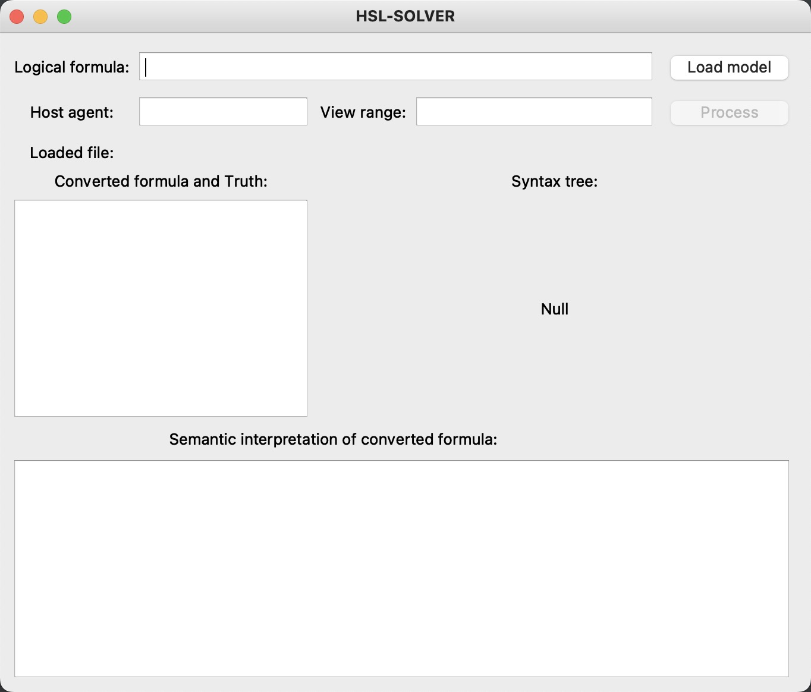
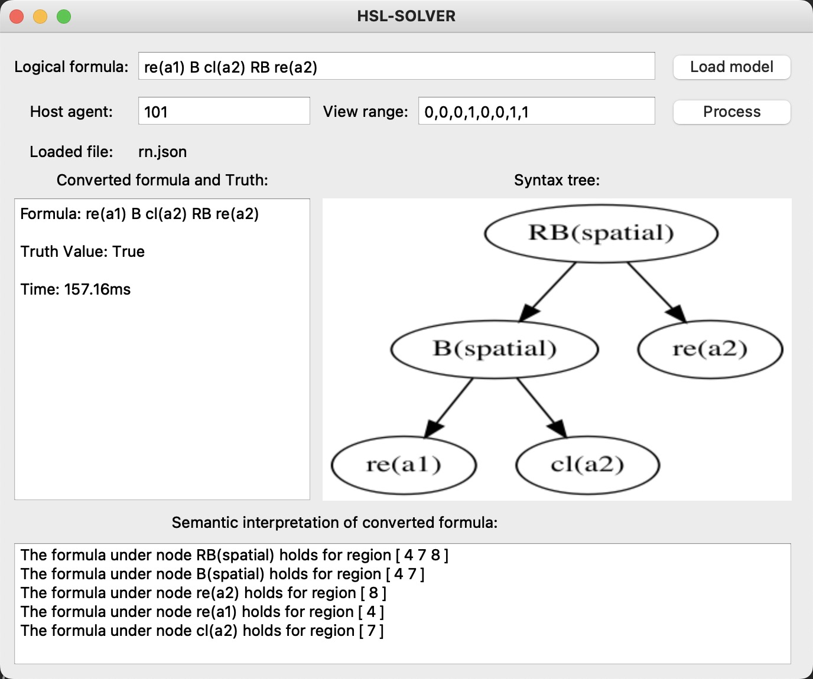

# THSL
1. This is an automated verification tool for HSL. It is very simple to run and verify that a given HSL formula is true.

2. Before running, be sure to check whether you have the following environment and install the following dependencies:
    ```java
   1. python3.6 
   2. PyQt5 for python
   3. z3 for python

3. Constraint generation algorithm is in `THSL/core/GenConstr.py` file, and model import method is in `THSL/core/GenModel.py` file.

4. The model file of the case is stored in the `THSL/core/model` file. If you need to test other use cases by yourself, please create the file format in the Model folder.

5. install the above dependencies and environment, and understand the file structure, you can directly run `THSL/gui/process.py`, will display the following interface:


6. click load model, you can choose from the `core/model` folder to select the corresponding model.

7. Enter HSL formula, such as `re(a1) B cl(a2) RB re(a2)`, host agent number: `101` and the field of view `0,0,0,1,0,0,1,1`, after clicking the Process button, you can get the truth value of the formula, the syntax tree composition of the formula, and an explanation of a viable solution returned by the tool if the result is true.

